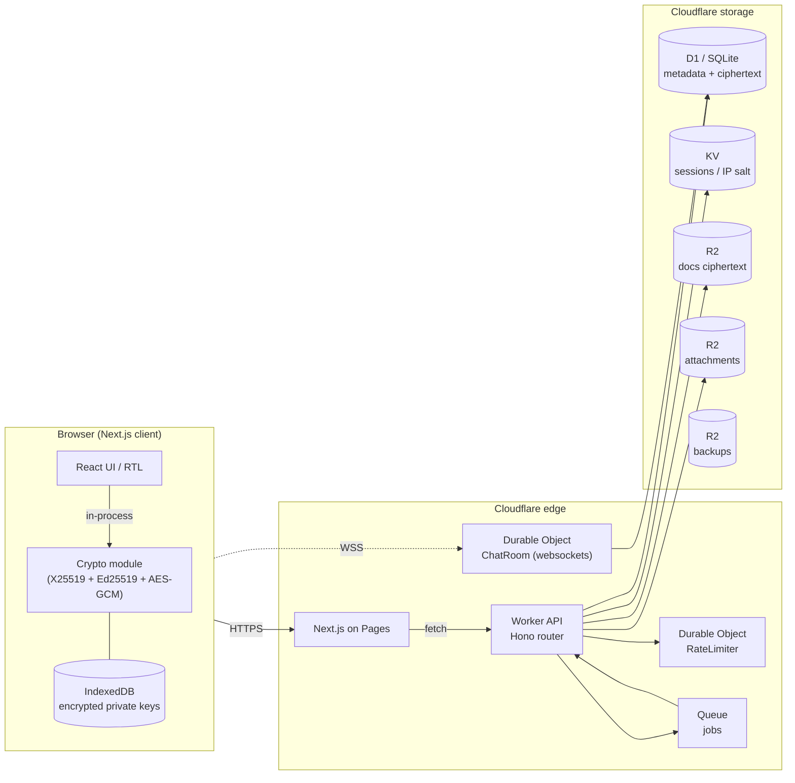

# Maranasi Intranet

Private, end-to-end encrypted internal workspace for **Maranasi Events**.
Bilingual (Arabic RTL / English), mobile-first, 100% Cloudflare-native.

> **Principles**
> - End-to-end encrypted chat. Server stores ciphertext only.
> - Zero-knowledge anonymous reports. No reporter identity is ever stored.
> - Cloudflare-only: Workers, D1, R2, KV, Durable Objects, Pages.
> - Arabic-first UI.
> - Audit everything that isn't E2EE.

---

## Architecture



---

## Repo layout

```
maranasi-intranet/
├── apps/
│   ├── web/                     Next.js 15 App Router (Cloudflare Pages)
│   │   ├── app/
│   │   │   ├── (auth)/login, signup
│   │   │   ├── (app)/chat, reports, docs, hr, settings
│   │   │   ├── report/          unbranded anonymous submit
│   │   │   └── track/           public status check
│   │   ├── components/
│   │   ├── lib/crypto/          X25519, X3DH, AES-GCM, KEK
│   │   ├── lib/i18n/            ar.json, en.json
│   │   └── lib/api-client.ts
│   └── api/                     Cloudflare Worker (Hono)
│       ├── src/
│       │   ├── routes/          auth, users, chat, reports, docs, hr, admin
│       │   ├── do/              ChatRoom, RateLimiter Durable Objects
│       │   ├── lib/             crypto, audit, mail, turnstile
│       │   └── middleware/
│       └── wrangler.toml
├── infra/d1-migrations/         versioned SQL
└── README.md (this file)
```

---

## Local development

Requirements: Node 20+, pnpm 9+, a Cloudflare account.

```bash
# 1. Install
pnpm install

# 2. Provision Cloudflare resources (one-time)
cd apps/api
wrangler login
wrangler d1 create maranasi-db
wrangler kv namespace create KV
wrangler r2 bucket create maranasi-docs
wrangler r2 bucket create maranasi-attachments
wrangler r2 bucket create maranasi-backups
wrangler queues create maranasi-jobs
# Paste the returned IDs into apps/api/wrangler.toml

# 3. Secrets (local)
cp apps/api/.dev.vars.example apps/api/.dev.vars
# Edit .dev.vars and fill in JWT_SECRET, PASSWORD_PEPPER, ORG_MASTER_KEY (base64 32 bytes)
openssl rand -base64 32           # generate ORG_MASTER_KEY

# 4. Migrate
pnpm db:migrate:local

# 5. Run both apps
pnpm dev
# api  → http://localhost:8787
# web  → http://localhost:3000
```

For production:

```bash
wrangler secret put JWT_SECRET
wrangler secret put PASSWORD_PEPPER
wrangler secret put ORG_MASTER_KEY
wrangler secret put TURNSTILE_SECRET_KEY
wrangler secret put MAILCHANNELS_DKIM_PRIVATE_KEY
pnpm db:migrate:prod
wrangler deploy
cd apps/web && pnpm pages:build && wrangler pages deploy
```

---

## Crypto threat model

This is the explicit "what is and isn't protected" table. The product is designed
around the assumption that an attacker may compromise individual components; the
goal is to ensure that compromising any one component is not catastrophic.

| Attacker capability                              | Can read chat? | Can read reports? | Can read docs? | Can impersonate? |
|---|---|---|---|---|
| Cloudflare employee with D1 read                  | **No** (ciphertext only) | **No** (encrypted to HR key) | Yes (org master key required) | No |
| Cloudflare employee with D1 + secrets             | No (chat ciphertext is bound to user-held keys; secrets do not include private chat keys) | No (HR private key never on server) | **Yes** (org master key is a Worker secret) | Yes, but limited to issuing new sessions for new logins |
| External attacker with stolen DB dump only        | No | No | No | No |
| Compromised user browser (logged in)              | That user's chats | If that user is HR, reports they can already see | Docs they can already access | That user |
| Stolen laptop, user is logged out                 | No (private keys are AES-encrypted under PBKDF2-derived KEK in IndexedDB) | No | No | No |
| Stolen laptop, user is logged in                  | Yes | If HR, yes | Yes | Yes |
| Network observer (in transit)                     | No (TLS) | No (TLS + payload also E2EE) | No | No |
| Replayed message ciphertext into different room   | **No** — AES-GCM AAD binds (roomId, senderId, timestamp) | n/a | n/a | n/a |

### Specifically NOT protected
- **Metadata.** Who messaged whom, when, message volumes — visible to anyone with D1 read.
- **Document confidentiality from Cloudflare.** Docs use envelope encryption with an org master key held as a Worker secret. This is server-side encryption at rest, not E2EE. Documented and intentional — search/preview would otherwise be impossible.
- **Forward secrecy.** v1 uses X3DH-lite + a static room AES key. A future v2 adds the Double Ratchet so compromise of a current key does not expose past or future messages.

---

## Recovery procedures

### Lost password
**There is no password recovery that preserves chat history.** This is deliberate.
Resetting the password generates new identity keys; old DM history is unreadable
because the room key was wrapped under the old identity pubkey.

A password reset:
1. Wipes that user's `user_key_bundles` row.
2. Forces them through signup-complete-like flow on next login (new keys).
3. Removes them from all rooms (so other members rotate keys before re-adding them).

### Lost HR private key
The HR public key encrypts every report. If the HR private key is lost, the
backlog of reports is unreadable.

**Mitigation:** the HR private key MUST be split via Shamir Secret Sharing (M-of-N)
across HR officers, stored offline (sealed envelopes / hardware keys). On rotation,
generate a new HR keypair, archive the old one (still M-of-N split), and new
reports use the new public key. Old reports remain readable using the old key.

A planned tool `scripts/hr-key-rotate.ts` outputs:
- The new public key (deploy via `POST /admin/hr-key`).
- Five Shamir shares of the new private key (3-of-5 threshold by default).

### Lost laptop while logged out
The private-key bundle in IndexedDB is encrypted under a PBKDF2(600k)-derived KEK.
An attacker would need the user's password to decrypt. As long as the password is
strong, the device is safe.

### Lost laptop while logged in
Treat as full compromise of that user. Admin must:
1. `DELETE /admin/users/:id` — soft-deletes user, revokes sessions.
2. Recreate the user via fresh invite (new keys generated).
3. Other members rotate any rooms the compromised user was in.

---

## Adding a new language

1. Copy `apps/web/lib/i18n/en.json` to `apps/web/lib/i18n/fr.json` (or whichever locale).
2. Translate every string. **Do not add new keys here; add them in `en.json` first.**
3. Register the locale in `lib/i18n/index.tsx`:

```ts
import fr from './fr.json';
const dicts = { ar, en, fr } as const;
```

4. Add a font with `next/font/google` if the script needs one.
5. Test RTL behavior — many CSS rules use `tailwindcss-rtl` directional helpers.

---

## Rotating the HR key

```bash
# Generate offline (Node REPL or shell):
node -e "
  const { x25519 } = require('@noble/curves/ed25519');
  const sk = x25519.utils.randomPrivateKey();
  const pk = x25519.getPublicKey(sk);
  console.log('PRIVATE_BASE64=', Buffer.from(sk).toString('base64'));
  console.log('PUBLIC_BASE64=', Buffer.from(pk).toString('base64'));
"

# 1. Split PRIVATE_BASE64 with Shamir (use `shamir-secret-sharing` or similar).
# 2. Distribute shares to HR officers (offline, sealed envelopes).
# 3. Submit the public key via the admin API:
curl -X POST https://api.maranasi-events.com/admin/hr-key \
  -H 'authorization: Bearer <admin token>' \
  -H 'content-type: application/json' \
  -d '{"publicKey":"PUBLIC_BASE64"}'

# 4. New reports immediately encrypt to the new key.
# 5. Old reports remain readable with the old private key.
```

---

## Security hardening checklist

- [x] CSP with no inline scripts (WASM allowed for argon2id).
- [x] HSTS preload, X-Frame-Options DENY, nosniff, strict-origin-when-cross-origin.
- [x] Secure / HttpOnly / SameSite=Strict cookies; refresh token rotation.
- [x] argon2id for passwords (m=19456, t=2, p=1) and tracking codes.
- [x] D1 prepared statements only — no string concat.
- [x] Turnstile required on /reports, /reports/track, /auth/signup-complete.
- [x] Sliding-window rate limiting (DO-backed): login, signup, report submit/track.
- [x] Daily-rotating IP salt for the audit log; raw IPs never persisted.
- [x] Cron: prune expired sessions, soft-deleted docs, expired reports, old audit rows.
- [x] R2 envelope encryption for documents (AES-KW + AES-GCM under org master key).
- [x] AES-GCM AAD binds (roomId, senderId, timestamp) on every message.
- [x] Append-only audit log; pruned after 2 years.
- [ ] R2 lifecycle rules for 30-day doc soft-delete window — **configure via dashboard**.
- [ ] Workers Logpush → R2 with Object Lock — **configure via dashboard**.
- [ ] D1 nightly backup → R2 with separate encryption key.

---

## v1 scope

Implemented:
- Auth (invite-based signup, login, refresh, logout, key-bundle).
- E2EE chat: rooms (DM + group), per-room AES key wrapped per member, key
  rotation on member removal, message AAD binding.
- Anonymous reports with HR public-key hybrid encryption + argon2 tracking codes.
- Document upload/download with envelope encryption.
- HR: leave requests, payslip ciphertext storage.
- Admin: invites, role management, audit log viewer, HR key rotation.
- Bilingual UI (ar/en) with RTL.

Deferred to v2:
- Double Ratchet (forward secrecy beyond X3DH).
- Voice / video.
- AI summarization (would defeat E2EE).
- Cross-room search server-side.
- Native mobile apps (PWA only).
